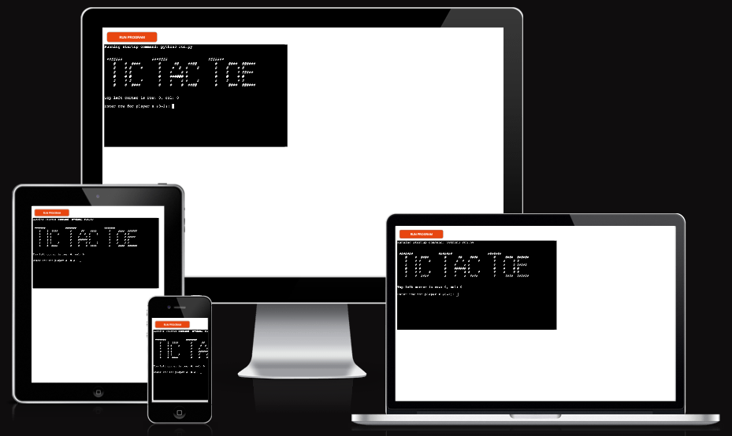
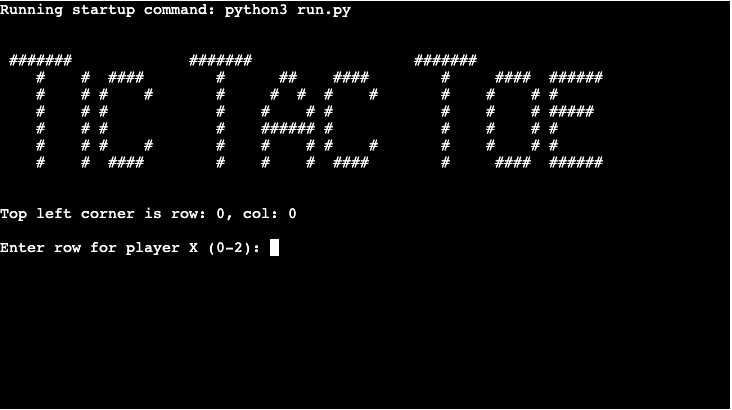
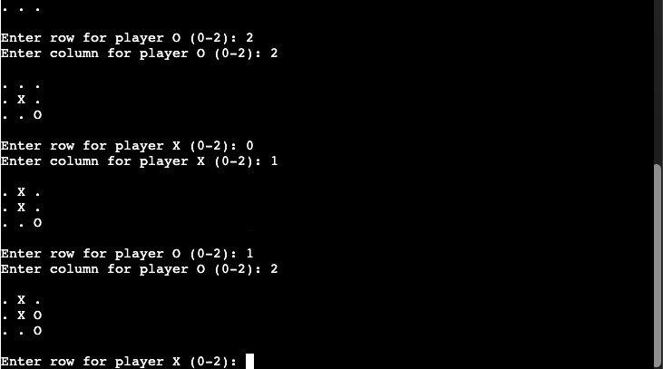
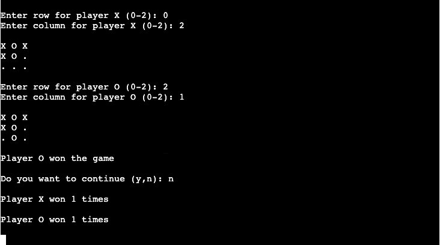

# Tic Tac Toe

Tic Tac Toe is a Python terminal game, which runs in a Code Institute mock terminal pn Heroku.

It is a game for two players who take turns marking the spaces in a three-by-three grid with X or O. 
The player who succeeds in placing three of their marks in a horizontal, vertical, or diagonal row is the winner. 
It is a solved game, with a forced draw assuming best play from both players.

[Here is the live version of my project](https://pp3-tic-tac-toe.herokuapp.com/)

## How To Play

Tic Tac Toe is based on the classic pen and paper game. You can read more about it on  [Wikipedia](https://en.wikipedia.org/wiki/Tic-tac-toe)

Tic-tac-toe is played on a three-by-three grid by two players, who alternately place the marks X and O in one of the nine spaces in the grid.

The grid starts with (0,0) coordinates and ends with (2,2). 

## Features

### Existing Features

* Enter user input

    Enter the first user input by inputing two coordinates a row and column. 
    Print the board.
    Enter the second user input by inputing two coordinates a row and column. 

* Input validation and error checking

    You cannot enter the coordinates outside the size of the grid.
    You must enter numbers.
    You cannot enter the same guess twice.

* Maintains scores

* The grid represented by the Bord class instance (board.py)

### Future Features

* Allow players to select the board size
* Play with computer

## Data Model

I decided to use a Board class to represent the data model. 
There is only one instance created. 
The Board class stores the size of the grid and the position of X and O input.
The class has many methods used to play the game. These methods are used in the main program run.py.

    add_move - to add X or O coordinates to the board.
    is_valid_move - to check if a move is valid.
    is_move_duplicate - to check if the move is duplicate i.e. it has been entered before
    is_full - to check if the board s full of moves
    is_winner - to check the winner
    print_board - to print the board.

## Testing

I have manually tested the game:

    * tested in the local terminal and on heroku
    * entered incorrect input: strings, values out of bounds and duplicate moves

### Validation Testing PEP8

    Initially I had many warning but I cleared all of them.
    Passed again the code through PEP8 linter and confirmed there are no problems

## Deployment

This project was deployed using Code Institute's mock terminal on Heroku

    1. Create a new Heroku app
    2. Set the buildback to Python and NodeJS in that order
    3. On the main repo page [Repo page](https://github.com/ssmerd/tic-tac-toe) navigate to the Code tab
    4. Select the HTTPs method click the copy button to copy the link
    3. Link Heroku app to the GitHub repository, link copied in step 4: https://github.com/ssmerd/tic-tac-toe.git
    4. Click on Deploy

 
 

## Forking the GitHub repo

 
 

In order to create a copy of the original repository on our GitHub account to view or edit it without affecting the original owner's repository we can fork it.

    1. At the top of the Repository [Repo page](https://github.com/ssmerd/tic-tac-toe), above the Settings button, locate the Fork button 
    2. Once clicked, it will create as a copy of the original repository in your own GitHub account

## Working with CodeAnywhere

I used CodeAnywhere to work on the project. 

## Credits

* Code Institute for the deployment terminal
* Wikipedia for details on Tic Tac Toe game

